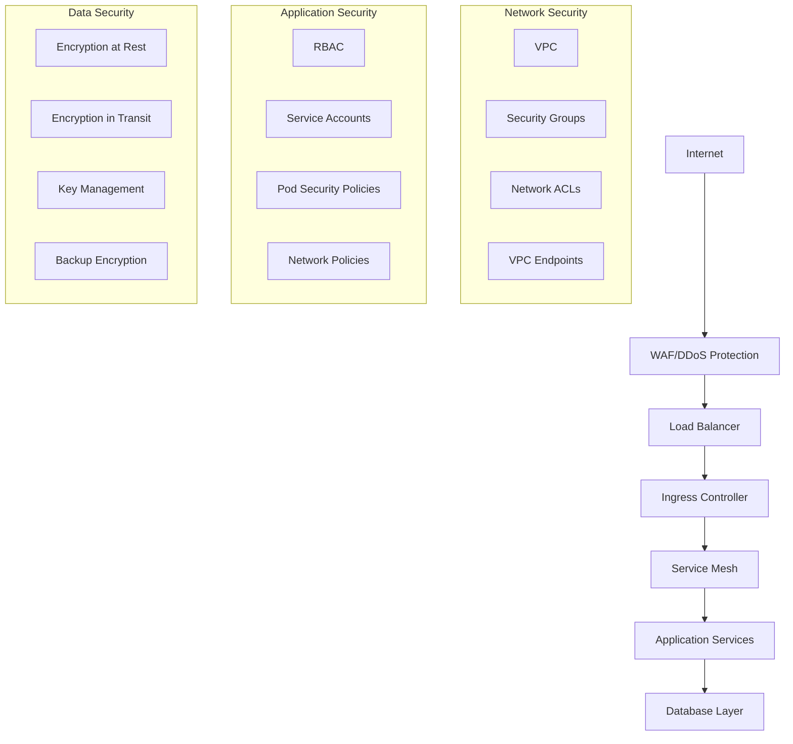

# WearForce-Clean Security and Compliance Guide

## Overview

This guide outlines the security architecture, compliance requirements, and operational procedures for maintaining a secure WearForce-Clean platform. It covers security controls, monitoring, incident response, and compliance frameworks.

## Security Architecture

### Defense in Depth Strategy



### Security Layers

#### 1. Network Security

**VPC Configuration:**
- Private subnets for application workloads
- Public subnets only for load balancers
- NAT Gateways for controlled internet access
- VPC Flow Logs for network monitoring

**Security Groups:**
```json
{
  "GroupName": "wearforce-clean-app-sg",
  "Rules": [
    {
      "Type": "ingress",
      "Protocol": "tcp",
      "Port": 8080,
      "Source": "lb-security-group"
    },
    {
      "Type": "ingress", 
      "Protocol": "tcp",
      "Port": 9090,
      "Source": "monitoring-sg"
    }
  ]
}
```

**Network Policies:**
```yaml
apiVersion: networking.k8s.io/v1
kind: NetworkPolicy
metadata:
  name: deny-all-ingress
  namespace: production
spec:
  podSelector: {}
  policyTypes:
  - Ingress
  - Egress
  egress:
  - to:
    - namespaceSelector:
        matchLabels:
          name: monitoring
  - to: []
    ports:
    - protocol: TCP
      port: 443
    - protocol: TCP
      port: 53
    - protocol: UDP
      port: 53
```

#### 2. Identity and Access Management

**Kubernetes RBAC:**
```yaml
apiVersion: rbac.authorization.k8s.io/v1
kind: Role
metadata:
  namespace: production
  name: wearforce-clean-developer
rules:
- apiGroups: [""]
  resources: ["pods", "services", "configmaps"]
  verbs: ["get", "list", "watch"]
- apiGroups: ["apps"]
  resources: ["deployments"]
  verbs: ["get", "list", "watch"]
```

**Service Account Configuration:**
```yaml
apiVersion: v1
kind: ServiceAccount
metadata:
  name: wearforce-clean-app
  namespace: production
  annotations:
    eks.amazonaws.com/role-arn: arn:aws:iam::ACCOUNT:role/wearforce-clean-app-role
automountServiceAccountToken: true
```

**AWS IAM Policies:**
```json
{
  "Version": "2012-10-17",
  "Statement": [
    {
      "Effect": "Allow",
      "Action": [
        "s3:GetObject",
        "s3:PutObject"
      ],
      "Resource": "arn:aws:s3:::wearforce-clean-app-data/*"
    },
    {
      "Effect": "Allow",
      "Action": [
        "secretsmanager:GetSecretValue"
      ],
      "Resource": "arn:aws:secretsmanager:us-west-2:ACCOUNT:secret:wearforce-clean/production/*"
    }
  ]
}
```

#### 3. Container Security

**Pod Security Standards:**
```yaml
apiVersion: v1
kind: Pod
metadata:
  name: secure-pod
spec:
  securityContext:
    runAsNonRoot: true
    runAsUser: 1000
    fsGroup: 2000
    seccompProfile:
      type: RuntimeDefault
  containers:
  - name: app
    securityContext:
      allowPrivilegeEscalation: false
      readOnlyRootFilesystem: true
      capabilities:
        drop:
        - ALL
        add:
        - NET_BIND_SERVICE
```

**Image Security:**
- Base images from trusted registries
- Regular vulnerability scanning with Trivy
- Image signing with Cosign
- SBOM generation for supply chain security

#### 4. Data Protection

**Encryption Configuration:**
```yaml
# Encryption at rest for EBS volumes
apiVersion: v1
kind: StorageClass
metadata:
  name: encrypted-gp3
provisioner: ebs.csi.aws.com
parameters:
  type: gp3
  encrypted: "true"
  kmsKeyId: alias/wearforce-clean-ebs-key
```

**Database Encryption:**
- RDS encryption at rest with KMS
- SSL/TLS for data in transit
- Application-level encryption for PII

**Secrets Management:**
```yaml
apiVersion: external-secrets.io/v1beta1
kind: SecretStore
metadata:
  name: aws-secrets-manager
  namespace: production
spec:
  provider:
    aws:
      service: SecretsManager
      region: us-west-2
      auth:
        jwt:
          serviceAccountRef:
            name: external-secrets-sa
```

## Security Monitoring

### Security Event Monitoring

**Log Sources:**
- Application audit logs
- Kubernetes audit logs
- AWS CloudTrail
- VPC Flow Logs
- Container runtime logs

**SIEM Integration:**
```yaml
# Fluentd configuration for security log forwarding
<source>
  @type tail
  path /var/log/containers/*.log
  pos_file /var/log/fluentd-containers.log.pos
  tag kubernetes.*
  read_from_head true
  <parse>
    @type json
  </parse>
</source>

<filter kubernetes.**>
  @type grep
  <regexp>
    key log
    pattern /ERROR|WARN|security|authentication|authorization/
  </regexp>
</filter>

<match kubernetes.**>
  @type elasticsearch
  host elasticsearch.logging.svc.cluster.local
  port 9200
  index_name security-logs
</match>
```

### Threat Detection

**Falco Rules:**
```yaml
- rule: Unauthorized System Call
  desc: Detect unauthorized system calls
  condition: >
    spawned_process and not proc.name in (authorized_processes)
  output: >
    Unauthorized process spawned (user=%user.name command=%proc.cmdline 
    container=%container.name image=%container.image.repository:%container.image.tag)
  priority: WARNING

- rule: Sensitive File Access
  desc: Detect access to sensitive files
  condition: >
    open_read and sensitive_files and not proc.name in (authorized_file_readers)
  output: >
    Sensitive file access (user=%user.name file=%fd.name command=%proc.cmdline
    container=%container.name)
  priority: WARNING
```

**Prometheus Security Metrics:**
```yaml
# Authentication failures
- record: wearforce-clean:auth_failures_rate
  expr: rate(http_requests_total{status_code=~"401|403"}[5m])

# Suspicious API activity
- record: wearforce-clean:suspicious_api_calls
  expr: rate(http_requests_total{path=~"/admin.*|/api/internal.*"}[5m])

# Failed login attempts
- record: wearforce-clean:failed_login_attempts
  expr: increase(login_attempts_total{status="failed"}[1h])
```

### Security Alerts

**Critical Security Alerts:**
```yaml
groups:
- name: security.rules
  rules:
  - alert: HighAuthenticationFailureRate
    expr: wearforce-clean:auth_failures_rate > 10
    for: 2m
    labels:
      severity: critical
    annotations:
      summary: "High authentication failure rate detected"
      description: "Authentication failure rate is {{ $value }} per second"

  - alert: SuspiciousAPIActivity
    expr: wearforce-clean:suspicious_api_calls > 5
    for: 1m
    labels:
      severity: warning
    annotations:
      summary: "Suspicious API activity detected"
      description: "Unusual activity on sensitive endpoints"

  - alert: PotentialBruteForceAttack
    expr: wearforce-clean:failed_login_attempts > 100
    for: 5m
    labels:
      severity: critical
    annotations:
      summary: "Potential brute force attack"
      description: "{{ $value }} failed login attempts in the last hour"
```

## Compliance Frameworks

### SOC 2 Type II Compliance

**Control Objectives:**
1. **Security:** Protection against unauthorized access
2. **Availability:** System operational availability
3. **Processing Integrity:** System processing completeness and accuracy
4. **Confidentiality:** Information designated as confidential is protected
5. **Privacy:** Personal information collection, use, and disclosure

**Evidence Collection:**
```bash
# Automated compliance reporting
kubectl create job compliance-report-$(date +%Y%m%d) \
  --from=cronjob/compliance-reporter \
  -n monitoring

# Generate access control report
kubectl exec -it compliance-reporter-pod -- python3 -c "
import json
from kubernetes import client, config

# Load kubeconfig
config.load_incluster_config()
v1 = client.RbacAuthorizationV1Api()

# Get all roles and bindings
roles = v1.list_cluster_role()
bindings = v1.list_cluster_role_binding()

report = {
    'timestamp': '$(date -u +%Y-%m-%dT%H:%M:%SZ)',
    'total_roles': len(roles.items),
    'total_bindings': len(bindings.items),
    'privileged_users': []
}

for binding in bindings.items:
    if 'cluster-admin' in binding.role_ref.name:
        for subject in binding.subjects or []:
            report['privileged_users'].append({
                'name': subject.name,
                'kind': subject.kind,
                'namespace': subject.namespace
            })

print(json.dumps(report, indent=2))
"
```

### GDPR Compliance

**Data Processing Documentation:**
```yaml
# ConfigMap for GDPR data processing record
apiVersion: v1
kind: ConfigMap
metadata:
  name: gdpr-processing-record
  namespace: production
data:
  processing_activities.json: |
    {
      "controller": {
        "name": "WearForce-Clean Inc.",
        "contact": "privacy@wearforce-clean.io"
      },
      "activities": [
        {
          "name": "User Account Management",
          "purpose": "Provide authentication and account services",
          "legal_basis": "Contract",
          "categories_of_data": ["Identity", "Contact"],
          "retention_period": "Account lifetime + 30 days",
          "recipients": ["Internal teams", "Cloud service providers"]
        }
      ]
    }
```

**Data Subject Rights Implementation:**
```python
# Data portability endpoint
@app.route('/api/user/<user_id>/export', methods=['GET'])
@require_auth
def export_user_data(user_id):
    # Verify user identity
    if not current_user.id == user_id:
        return jsonify({'error': 'Unauthorized'}), 403
    
    # Collect all user data
    user_data = {
        'profile': get_user_profile(user_id),
        'conversations': get_user_conversations(user_id),
        'preferences': get_user_preferences(user_id)
    }
    
    # Log data export request
    audit_log.info(f"Data export requested by user {user_id}")
    
    return jsonify(user_data)

# Right to be forgotten endpoint
@app.route('/api/user/<user_id>/delete', methods=['DELETE'])
@require_auth
def delete_user_data(user_id):
    # Verify user identity and consent
    if not current_user.id == user_id:
        return jsonify({'error': 'Unauthorized'}), 403
    
    # Schedule data deletion job
    delete_job_id = schedule_data_deletion(user_id)
    
    # Log deletion request
    audit_log.info(f"Data deletion requested by user {user_id}, job_id: {delete_job_id}")
    
    return jsonify({'job_id': delete_job_id, 'status': 'scheduled'})
```

### PCI DSS Compliance (if applicable)

**Payment Data Handling:**
```python
# Example of secure payment processing
import hashlib
import hmac
from cryptography.fernet import Fernet

class PaymentProcessor:
    def __init__(self):
        self.encryption_key = os.environ.get('PAYMENT_ENCRYPTION_KEY')
        self.cipher = Fernet(self.encryption_key.encode())
    
    def tokenize_card(self, card_number):
        # Never store actual card numbers
        token = hashlib.sha256(card_number.encode()).hexdigest()[:16]
        
        # Log tokenization (without sensitive data)
        audit_log.info(f"Card tokenized: {token}")
        
        return token
    
    def process_payment(self, amount, token):
        # Forward to PCI-compliant payment processor
        # Never handle card data directly
        return external_payment_gateway.charge(amount, token)
```

**Network Segmentation for PCI:**
```yaml
# Network policy for payment processing isolation
apiVersion: networking.k8s.io/v1
kind: NetworkPolicy
metadata:
  name: payment-isolation
  namespace: production
spec:
  podSelector:
    matchLabels:
      app: payment-processor
  policyTypes:
  - Ingress
  - Egress
  ingress:
  - from:
    - podSelector:
        matchLabels:
          app: api-gateway
    ports:
    - protocol: TCP
      port: 8080
  egress:
  - to: []  # Allow external payment gateway only
    ports:
    - protocol: TCP
      port: 443
```

## Security Operations

### Vulnerability Management

**Automated Scanning:**
```yaml
# CronJob for regular vulnerability scanning
apiVersion: batch/v1
kind: CronJob
metadata:
  name: vulnerability-scan
  namespace: security
spec:
  schedule: "0 2 * * *"  # Daily at 2 AM
  jobTemplate:
    spec:
      template:
        spec:
          containers:
          - name: trivy-scanner
            image: aquasecurity/trivy:latest
            command:
            - /bin/sh
            - -c
            - |
              # Scan all running containers
              kubectl get pods --all-namespaces -o jsonpath='{.items[*].spec.containers[*].image}' | \
              tr ' ' '\n' | sort -u | while read image; do
                echo "Scanning $image"
                trivy image --severity CRITICAL,HIGH --format json $image > /tmp/scan-results.json
                
                # Process results and create alerts
                python3 /scripts/process-vulnerabilities.py /tmp/scan-results.json
              done
          restartPolicy: OnFailure
```

**Patch Management Process:**
1. **Assessment (24 hours):** Evaluate vulnerability impact
2. **Testing (48 hours):** Test patches in staging environment
3. **Deployment (72 hours):** Deploy to production with rollback plan
4. **Verification (24 hours):** Confirm patch effectiveness

### Security Incident Response

**Incident Classification:**
- **P1 - Critical:** Active breach, data exfiltration
- **P2 - High:** Unauthorized access, system compromise
- **P3 - Medium:** Policy violations, suspicious activity
- **P4 - Low:** Security misconfigurations, minor violations

**Response Procedures:**
```bash
#!/bin/bash
# Security incident response script

case "$1" in
  "data-breach")
    # Immediate containment
    kubectl scale deployment --replicas=0 -n production
    
    # Isolate affected systems
    kubectl apply -f security/network-policies/emergency-isolation.yaml
    
    # Preserve evidence
    kubectl get events --all-namespaces > /tmp/k8s-events.log
    kubectl logs --all-containers=true --prefix=true -p > /tmp/pod-logs.log
    
    # Notify stakeholders
    curl -X POST -H 'Content-type: application/json' \
      --data '{"text":"🚨 SECURITY INCIDENT: Data breach detected. Immediate response initiated."}' \
      $SECURITY_SLACK_WEBHOOK
    ;;
    
  "malware-detection")
    # Quarantine affected pods
    kubectl label pod $2 quarantine=true -n $3
    kubectl apply -f security/network-policies/quarantine-policy.yaml
    
    # Run forensic collection
    kubectl exec -it $2 -n $3 -- /bin/bash -c "
      ps aux > /tmp/processes.log
      netstat -tulpn > /tmp/network.log
      find /tmp -type f -exec ls -la {} \; > /tmp/filesystem.log
    "
    ;;
esac
```

### Access Control Management

**User Access Review Process:**
```python
# Automated access review script
import json
from datetime import datetime, timedelta
from kubernetes import client, config

def quarterly_access_review():
    config.load_incluster_config()
    rbac_api = client.RbacAuthorizationV1Api()
    
    # Get all role bindings
    bindings = rbac_api.list_cluster_role_binding()
    
    review_report = {
        'timestamp': datetime.utcnow().isoformat(),
        'review_period': 'Q1 2025',
        'findings': []
    }
    
    for binding in bindings.items:
        # Check for overprivileged roles
        if 'admin' in binding.role_ref.name.lower():
            for subject in binding.subjects or []:
                review_report['findings'].append({
                    'type': 'overprivileged_access',
                    'user': subject.name,
                    'role': binding.role_ref.name,
                    'recommendation': 'Review necessity of admin privileges'
                })
        
        # Check for unused service accounts
        if binding.metadata.creation_timestamp < datetime.utcnow() - timedelta(days=90):
            last_used = check_service_account_usage(binding.subjects)
            if not last_used:
                review_report['findings'].append({
                    'type': 'unused_access',
                    'binding': binding.metadata.name,
                    'recommendation': 'Consider removing unused role binding'
                })
    
    return review_report

def check_service_account_usage(subjects):
    # Check audit logs for service account usage
    # Implementation depends on log aggregation system
    pass
```

## Security Best Practices

### Development Security

**Secure Coding Guidelines:**
1. Input validation and sanitization
2. Parameterized queries to prevent SQL injection
3. Proper error handling without information disclosure
4. Secure session management
5. Encryption of sensitive data at rest and in transit

**Code Security Review:**
```yaml
# GitHub Actions security review workflow
name: Security Review
on:
  pull_request:
    branches: [main, develop]

jobs:
  security-scan:
    runs-on: ubuntu-latest
    steps:
    - uses: actions/checkout@v4
    
    - name: Run Semgrep
      uses: semgrep/semgrep-action@v1
      with:
        config: >-
          p/security-audit
          p/secrets
          p/owasp-top-ten
    
    - name: Run Bandit (Python)
      run: |
        pip install bandit
        bandit -r . -f json -o bandit-report.json
    
    - name: Run Gosec (Go)
      run: |
        go install github.com/securecodewarrior/gosec/v2/cmd/gosec@latest
        gosec -fmt json -out gosec-report.json ./...
```

### Deployment Security

**Secure Deployment Checklist:**
- [ ] All images scanned for vulnerabilities
- [ ] No hardcoded secrets in containers
- [ ] Resource limits configured
- [ ] Security contexts defined
- [ ] Network policies applied
- [ ] RBAC permissions minimal
- [ ] Monitoring and logging enabled

**Production Security Validation:**
```bash
#!/bin/bash
# Production security validation script

echo "Running production security validation..."

# Check for privileged containers
PRIVILEGED_PODS=$(kubectl get pods --all-namespaces -o jsonpath='{.items[?(@.spec.securityContext.privileged==true)].metadata.name}')
if [ -n "$PRIVILEGED_PODS" ]; then
  echo "❌ Found privileged containers: $PRIVILEGED_PODS"
  exit 1
fi

# Check for containers running as root
ROOT_CONTAINERS=$(kubectl get pods --all-namespaces -o jsonpath='{.items[?(@.spec.securityContext.runAsUser==0)].metadata.name}')
if [ -n "$ROOT_CONTAINERS" ]; then
  echo "❌ Found containers running as root: $ROOT_CONTAINERS"
  exit 1
fi

# Check for missing resource limits
NO_LIMITS=$(kubectl get pods --all-namespaces -o jsonpath='{.items[?(!@.spec.containers[0].resources.limits)].metadata.name}')
if [ -n "$NO_LIMITS" ]; then
  echo "⚠️  Pods without resource limits: $NO_LIMITS"
fi

# Check network policies
NAMESPACES=$(kubectl get namespaces -o jsonpath='{.items[*].metadata.name}')
for ns in $NAMESPACES; do
  POLICIES=$(kubectl get networkpolicies -n $ns --no-headers 2>/dev/null | wc -l)
  if [ $POLICIES -eq 0 ]; then
    echo "⚠️  No network policies in namespace: $ns"
  fi
done

echo "✅ Security validation complete"
```

## Compliance Reporting

### Automated Compliance Reports

**Monthly Security Report:**
```python
# Automated security report generation
import json
from datetime import datetime, timedelta

def generate_monthly_security_report():
    report_date = datetime.utcnow()
    report = {
        'report_date': report_date.isoformat(),
        'period': 'monthly',
        'metrics': {},
        'incidents': [],
        'compliance_status': {}
    }
    
    # Security metrics
    report['metrics'] = {
        'vulnerability_scans_completed': get_vulnerability_scan_count(),
        'critical_vulnerabilities': get_critical_vulnerability_count(),
        'security_patches_applied': get_patch_count(),
        'failed_login_attempts': get_failed_login_count(),
        'security_incidents': get_incident_count()
    }
    
    # Compliance status
    report['compliance_status'] = {
        'soc2': check_soc2_compliance(),
        'gdpr': check_gdpr_compliance(),
        'access_reviews_completed': check_access_reviews()
    }
    
    # Generate recommendations
    report['recommendations'] = generate_security_recommendations(report['metrics'])
    
    return report

def check_soc2_compliance():
    # Check SOC 2 control implementation
    controls = {
        'access_control': check_rbac_implementation(),
        'data_encryption': check_encryption_status(),
        'monitoring': check_monitoring_coverage(),
        'incident_response': check_incident_response_procedures(),
        'change_management': check_change_management_process()
    }
    
    compliance_score = sum(controls.values()) / len(controls) * 100
    
    return {
        'score': compliance_score,
        'status': 'compliant' if compliance_score >= 95 else 'non_compliant',
        'controls': controls
    }
```

### Audit Trail Management

**Audit Log Configuration:**
```yaml
# Kubernetes audit policy
apiVersion: audit.k8s.io/v1
kind: Policy
rules:
# Log requests to sensitive resources
- level: RequestResponse
  namespaces: ["production", "staging"]
  resources:
  - group: ""
    resources: ["secrets", "configmaps"]
  - group: "rbac.authorization.k8s.io"
    resources: ["roles", "clusterroles", "rolebindings", "clusterrolebindings"]

# Log authentication and authorization decisions
- level: Request
  users: ["system:anonymous"]
  namespaces: ["production"]
  
# Log exec commands
- level: Request
  resources:
  - group: ""
    resources: ["pods/exec", "pods/portforward"]
  namespaces: ["production"]

# Don't log requests to certain non-sensitive resources
- level: None
  resources:
  - group: ""
    resources: ["events", "nodes/status", "pods/status"]
```

**Audit Log Processing:**
```python
# Audit log analysis for compliance
import json
import re
from datetime import datetime

def analyze_audit_logs(log_file):
    suspicious_activities = []
    compliance_violations = []
    
    with open(log_file, 'r') as f:
        for line in f:
            try:
                entry = json.loads(line)
                
                # Check for suspicious activities
                if entry.get('verb') == 'create' and 'secret' in entry.get('objectRef', {}).get('resource', ''):
                    if not is_authorized_secret_creation(entry):
                        suspicious_activities.append({
                            'timestamp': entry['timestamp'],
                            'user': entry['user']['username'],
                            'action': 'unauthorized_secret_creation',
                            'resource': entry['objectRef']['name']
                        })
                
                # Check for privilege escalation
                if entry.get('verb') == 'create' and 'rolebinding' in entry.get('objectRef', {}).get('resource', ''):
                    if contains_admin_privileges(entry):
                        compliance_violations.append({
                            'timestamp': entry['timestamp'],
                            'user': entry['user']['username'],
                            'violation': 'privilege_escalation',
                            'details': entry['objectRef']
                        })
                        
            except json.JSONDecodeError:
                continue
    
    return {
        'suspicious_activities': suspicious_activities,
        'compliance_violations': compliance_violations
    }
```

## Conclusion

This security and compliance guide provides the foundation for maintaining a secure WearForce-Clean platform. Regular reviews and updates ensure continued effectiveness against evolving threats and changing compliance requirements.

**Key Contacts:**
- **Security Team**: security@wearforce-clean.io
- **Compliance Officer**: compliance@wearforce-clean.io
- **Security Incident Hotline**: +1-555-SECURITY

**Next Review Date**: 2025-04-07  
**Document Version**: 1.0.0  
**Owner**: Security Team