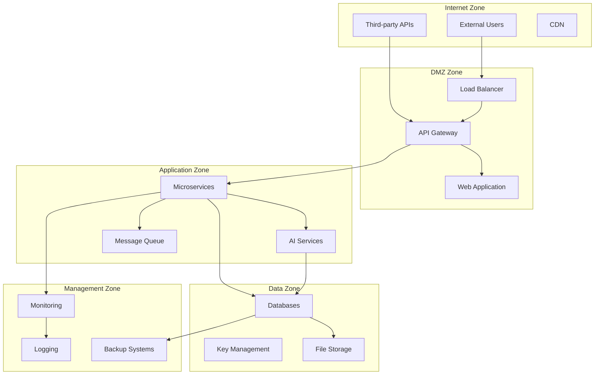
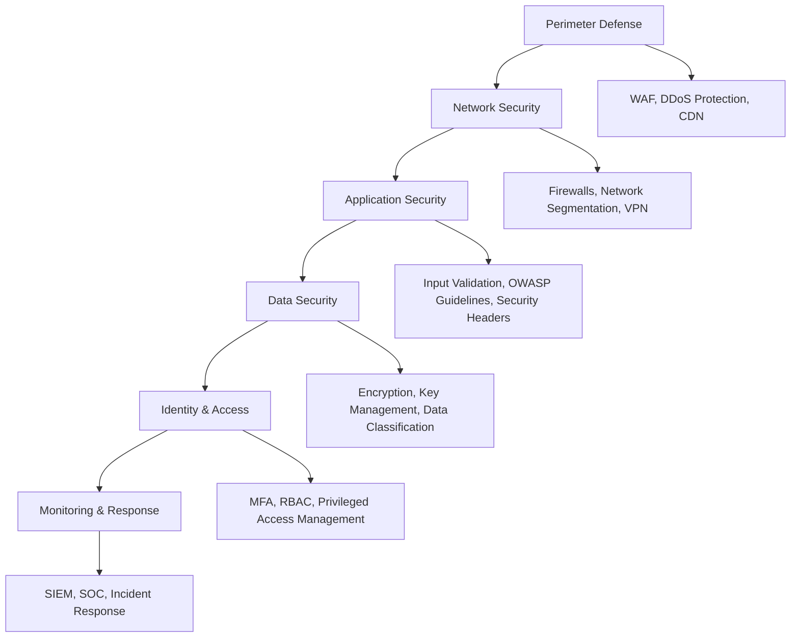

# WearForce-Clean Platform - Security Threat Model

## Executive Summary

This document presents a comprehensive threat model for the WearForce-Clean platform, identifying potential security threats, attack vectors, and corresponding mitigation strategies. The threat model follows the STRIDE methodology and aligns with OWASP guidelines.

## Table of Contents

1. [System Overview](#system-overview)
2. [Trust Boundaries](#trust-boundaries)
3. [Data Flow Analysis](#data-flow-analysis)
4. [Threat Analysis using STRIDE](#threat-analysis-using-stride)
5. [Attack Scenarios](#attack-scenarios)
6. [Risk Assessment](#risk-assessment)
7. [Mitigation Strategies](#mitigation-strategies)
8. [Security Controls](#security-controls)
9. [Compliance Considerations](#compliance-considerations)
10. [Continuous Monitoring](#continuous-monitoring)

## System Overview

WearForce-Clean is a comprehensive platform consisting of:

- **Wearable Devices**: WatchOS and WearOS applications
- **Mobile Applications**: iOS and Android native apps
- **Web Application**: React-based dashboard
- **API Gateway**: Go-based gateway with authentication and routing
- **Microservices**: Python-based business services (CRM, ERP, Notification)
- **AI Services**: LLM, NLU, RAG, STT, TTS processing services
- **Data Layer**: PostgreSQL databases with Redis caching
- **Infrastructure**: Kubernetes cluster with supporting services

### Key Data Types

- **PII (Personally Identifiable Information)**: User profiles, contact information
- **Authentication Data**: Credentials, session tokens, device certificates
- **Business Data**: CRM records, ERP transactions, notifications
- **Communication Data**: Chat logs, audio transcripts, AI interactions
- **Payment Data**: Credit card information, billing addresses (PCI DSS scope)
- **Biometric Data**: Voice patterns, usage patterns from wearables

## Trust Boundaries



### Trust Boundary Analysis

1. **Internet to DMZ**: Highest risk boundary, requires strong perimeter defense
2. **DMZ to Application**: Critical authentication and authorization checkpoint
3. **Application to Data**: Sensitive data access, requires encryption and auditing
4. **Cross-service Communication**: Service-to-service authentication required
5. **Management Interfaces**: Administrative access, requires privileged access controls

## Data Flow Analysis

### Critical Data Flows

1. **User Authentication Flow**
   ```
   Client → API Gateway → Keycloak → Database
   ```
   - **Threats**: Credential interception, token hijacking, replay attacks
   - **Controls**: TLS encryption, JWT validation, rate limiting

2. **Voice Processing Flow**
   ```
   Wearable → Gateway → STT Service → NLU Service → LLM Service → Database
   ```
   - **Threats**: Audio interception, voice cloning, data poisoning
   - **Controls**: End-to-end encryption, voice authentication, content filtering

3. **Payment Processing Flow**
   ```
   Client → Gateway → Payment Service → External Processor → Database
   ```
   - **Threats**: Card data theft, transaction manipulation, PCI violations
   - **Controls**: Tokenization, encryption, PCI DSS compliance, fraud detection

4. **Data Export Flow (GDPR)**
   ```
   User Request → Gateway → Compliance Service → All Services → Export Package
   ```
   - **Threats**: Unauthorized data access, data leakage, incomplete erasure
   - **Controls**: User verification, data masking, audit logging

## Threat Analysis using STRIDE

### Spoofing (S)

| Threat | Component | Impact | Likelihood | Risk Score | Mitigation |
|--------|-----------|--------|------------|------------|------------|
| User Identity Spoofing | Authentication | High | Medium | High | Multi-factor authentication, device certificates |
| Service Impersonation | Microservices | High | Low | Medium | mTLS, service mesh authentication |
| Device Spoofing | Wearables | Medium | Medium | Medium | Device attestation, hardware security |
| API Endpoint Spoofing | API Gateway | High | Low | Medium | Certificate pinning, domain validation |

### Tampering (T)

| Threat | Component | Impact | Likelihood | Risk Score | Mitigation |
|--------|-----------|--------|------------|------------|------------|
| Data Modification | Database | High | Medium | High | Integrity checks, audit logging, encryption |
| Request Tampering | API Gateway | Medium | High | High | Request signing, parameter validation |
| Code Injection | Web Application | High | Medium | High | Input sanitization, parameterized queries |
| Configuration Tampering | Infrastructure | High | Low | Medium | Infrastructure as Code, change management |

### Repudiation (R)

| Threat | Component | Impact | Likelihood | Risk Score | Mitigation |
|--------|-----------|--------|------------|------------|------------|
| Transaction Denial | Payment System | High | Medium | High | Digital signatures, audit trails |
| Action Denial | User Actions | Medium | High | Medium | Comprehensive logging, user confirmation |
| System Access Denial | Administrative | High | Low | Medium | Privileged access monitoring |

### Information Disclosure (I)

| Threat | Component | Impact | Likelihood | Risk Score | Mitigation |
|--------|-----------|--------|------------|------------|------------|
| Database Breach | Data Layer | Critical | Medium | Critical | Encryption at rest, access controls |
| API Data Leakage | Microservices | High | Medium | High | Response filtering, rate limiting |
| Log Information Leakage | Logging System | Medium | High | High | Log sanitization, access controls |
| Backup Data Exposure | Backup Systems | High | Low | Medium | Backup encryption, secure storage |
| Memory Dump Analysis | Application Servers | Medium | Low | Low | Memory protection, process isolation |

### Denial of Service (D)

| Threat | Component | Impact | Likelihood | Risk Score | Mitigation |
|--------|-----------|--------|------------|------------|------------|
| DDoS Attack | Load Balancer | High | High | Critical | Rate limiting, CDN, auto-scaling |
| Resource Exhaustion | AI Services | Medium | Medium | Medium | Resource limits, circuit breakers |
| Database Overload | Data Layer | High | Medium | High | Connection pooling, query optimization |
| Storage Exhaustion | File System | Medium | Low | Low | Disk quotas, monitoring |

### Elevation of Privilege (E)

| Threat | Component | Impact | Likelihood | Risk Score | Mitigation |
|--------|-----------|--------|------------|------------|------------|
| Container Escape | Kubernetes | High | Low | Medium | Security contexts, runtime protection |
| SQL Injection | Database | Critical | Medium | Critical | Parameterized queries, least privilege |
| JWT Token Elevation | Authentication | High | Medium | High | Token validation, short expiration |
| Administrative Access | Management | Critical | Low | High | Privileged access management, monitoring |

## Attack Scenarios

### Scenario 1: Advanced Persistent Threat (APT)

**Attack Vector**: Sophisticated attacker gains initial foothold through spear-phishing

**Attack Chain**:
1. Compromise employee workstation
2. Lateral movement to development environment
3. Code injection into CI/CD pipeline
4. Backdoor deployment to production
5. Data exfiltration over encrypted channels

**Impact**: Complete system compromise, data breach, regulatory violations

**Mitigation**:
- Security awareness training
- Zero-trust network architecture
- Code signing and integrity checks
- Runtime application protection
- Advanced threat detection

### Scenario 2: Supply Chain Attack

**Attack Vector**: Compromise of third-party dependencies or services

**Attack Chain**:
1. Malicious code in npm/pip package
2. Automated inclusion in build process
3. Deployment to production
4. Remote code execution capability
5. Data harvesting and system manipulation

**Impact**: Widespread system compromise, customer data theft, service disruption

**Mitigation**:
- Dependency scanning and verification
- Software Bill of Materials (SBOM)
- Vendor security assessments
- Runtime monitoring
- Incident response procedures

### Scenario 3: Insider Threat

**Attack Vector**: Malicious or compromised insider with legitimate access

**Attack Chain**:
1. Abuse of legitimate credentials
2. Access to sensitive data
3. Data export or modification
4. Cover-up of malicious activity
5. Continued access exploitation

**Impact**: Data breach, system sabotage, regulatory violations, reputation damage

**Mitigation**:
- Principle of least privilege
- Privileged access monitoring
- Data loss prevention
- Background checks and training
- Behavioral analytics

### Scenario 4: API Attack Chain

**Attack Vector**: Exploitation of API vulnerabilities

**Attack Chain**:
1. API enumeration and discovery
2. Authentication bypass or credential stuffing
3. Privilege escalation through parameter manipulation
4. Mass data extraction via automated requests
5. Account takeover and fraudulent activities

**Impact**: Data breach, financial fraud, service disruption

**Mitigation**:
- API security testing
- Rate limiting and throttling
- Input validation and sanitization
- OAuth 2.0 with PKCE
- API monitoring and alerting

## Risk Assessment

### Risk Scoring Matrix

| Impact / Likelihood | Low | Medium | High | Critical |
|---------------------|-----|--------|------|----------|
| **Critical** | High | Critical | Critical | Critical |
| **High** | Medium | High | Critical | Critical |
| **Medium** | Low | Medium | High | Critical |
| **Low** | Low | Low | Medium | High |

### Critical Risks (Requiring Immediate Attention)

1. **Database Breach** (Critical/Medium) - Encryption, access controls, monitoring
2. **DDoS Attack** (High/High) - CDN, rate limiting, auto-scaling
3. **SQL Injection** (Critical/Medium) - Code review, parameterized queries
4. **JWT Token Elevation** (High/Medium) - Token validation, short expiration

### High Risks (Requiring Mitigation)

1. **Data Modification** (High/Medium) - Integrity checks, audit logging
2. **Request Tampering** (Medium/High) - Request signing, validation
3. **Transaction Denial** (High/Medium) - Digital signatures, audit trails
4. **API Data Leakage** (High/Medium) - Response filtering, access controls

## Mitigation Strategies

### Defense in Depth Strategy



### Security Control Categories

#### Preventive Controls
- Multi-factor authentication
- Input validation and sanitization
- Encryption at rest and in transit
- Network segmentation
- Access control policies

#### Detective Controls
- Security information and event management (SIEM)
- Intrusion detection systems
- Log monitoring and analysis
- Vulnerability scanning
- Security metrics and KPIs

#### Corrective Controls
- Incident response procedures
- Automated threat response
- Backup and recovery systems
- Security patches and updates
- Security training and awareness

#### Compensating Controls
- Additional authentication factors
- Enhanced monitoring
- Manual approval processes
- Alternative communication channels
- Physical security measures

## Security Controls

### Authentication & Authorization

| Control | Implementation | Status |
|---------|----------------|---------|
| Multi-Factor Authentication | Keycloak with TOTP/WebAuthn | ✅ Implemented |
| OAuth2/OIDC | Keycloak integration | ✅ Implemented |
| Device Code Flow | Wearable device authentication | ✅ Implemented |
| Role-Based Access Control | OPA policy engine | ✅ Implemented |
| JWT Token Validation | JWK-based validation | ✅ Implemented |

### Data Protection

| Control | Implementation | Status |
|---------|----------------|---------|
| Encryption at Rest | AES-256-GCM database encryption | ✅ Implemented |
| Encryption in Transit | TLS 1.3 for all communications | ✅ Implemented |
| Key Management | Automated key rotation | ✅ Implemented |
| Data Classification | PII, Payment, Confidential levels | ✅ Implemented |
| Data Loss Prevention | Field-level encryption | ✅ Implemented |

### Network Security

| Control | Implementation | Status |
|---------|----------------|---------|
| Network Segmentation | Kubernetes network policies | 🚧 In Progress |
| WAF Protection | CloudFlare/AWS WAF | ⏳ Planned |
| DDoS Protection | CDN and rate limiting | ✅ Implemented |
| VPN Access | Site-to-site and client VPN | ⏳ Planned |
| DNS Security | Secure DNS resolution | ⏳ Planned |

### Application Security

| Control | Implementation | Status |
|---------|----------------|---------|
| Input Validation | Comprehensive sanitization | ✅ Implemented |
| Output Encoding | Context-aware encoding | ✅ Implemented |
| Security Headers | CSP, HSTS, X-Frame-Options | ✅ Implemented |
| CORS Configuration | Strict origin policies | ✅ Implemented |
| Rate Limiting | Redis-based rate limiting | ✅ Implemented |

### Monitoring & Logging

| Control | Implementation | Status |
|---------|----------------|---------|
| Audit Logging | Comprehensive audit trails | ✅ Implemented |
| Security Monitoring | Real-time threat detection | ✅ Implemented |
| Log Management | Centralized log aggregation | ✅ Implemented |
| Incident Response | Automated response workflows | 🚧 In Progress |
| Metrics & Alerting | Prometheus and Grafana | ✅ Implemented |

## Compliance Considerations

### GDPR Compliance

- **Data Subject Rights**: Right to access, rectification, erasure, portability
- **Consent Management**: Granular consent tracking and withdrawal
- **Data Processing Records**: Article 30 compliance documentation
- **Privacy by Design**: Built-in privacy protections
- **Data Protection Officer**: Designated privacy contact

### PCI DSS Compliance

- **Secure Network**: Firewalls and network segmentation
- **Protect Cardholder Data**: Encryption and tokenization
- **Vulnerability Management**: Regular scanning and patching
- **Access Control**: Restricted access to payment data
- **Monitoring**: Comprehensive audit logging
- **Information Security Policy**: Documented security policies

### SOC 2 Type II

- **Security**: Protection against unauthorized access
- **Availability**: System operational availability
- **Processing Integrity**: Complete and accurate processing
- **Confidentiality**: Protection of confidential information
- **Privacy**: Collection, use, and disclosure of personal information

## Continuous Monitoring

### Security Metrics

1. **Authentication Metrics**
   - Failed login attempts
   - Account lockouts
   - MFA adoption rate
   - Token expiration events

2. **Access Control Metrics**
   - Permission escalation attempts
   - Unauthorized access attempts
   - Role assignment changes
   - Privileged account usage

3. **Data Protection Metrics**
   - Encryption coverage percentage
   - Key rotation frequency
   - Data classification compliance
   - Privacy request response times

4. **Network Security Metrics**
   - DDoS attack frequency
   - Blocked malicious requests
   - Network policy violations
   - VPN connection anomalies

5. **Application Security Metrics**
   - Input validation failures
   - Security header compliance
   - CORS policy violations
   - Rate limiting activations

### Threat Intelligence Integration

- **Indicators of Compromise (IoCs)**: IP addresses, domains, file hashes
- **Threat Feeds**: Commercial and open source threat intelligence
- **Behavioral Analysis**: Machine learning-based anomaly detection
- **Threat Hunting**: Proactive threat identification

### Security Assessment Schedule

| Assessment Type | Frequency | Scope | Responsibility |
|----------------|-----------|-------|---------------|
| Vulnerability Scan | Weekly | All systems | Security Team |
| Penetration Test | Quarterly | Critical systems | External Vendor |
| Code Security Review | Per release | New code | Development Team |
| Security Architecture Review | Bi-annually | Entire platform | Security Architect |
| Compliance Audit | Annually | Full compliance scope | Compliance Team |

## Conclusion

This threat model provides a comprehensive analysis of security risks facing the WearForce-Clean platform. The identified threats and corresponding mitigation strategies should be regularly reviewed and updated as the platform evolves and new threats emerge.

Key recommendations:
1. Implement all Critical and High-risk mitigations immediately
2. Establish continuous security monitoring and alerting
3. Conduct regular security assessments and penetration testing
4. Maintain up-to-date threat intelligence and incident response capabilities
5. Ensure ongoing security training for all team members

**Document Version**: 1.0  
**Last Updated**: 2025-01-08  
**Next Review**: 2025-04-08  
**Owner**: Security Team