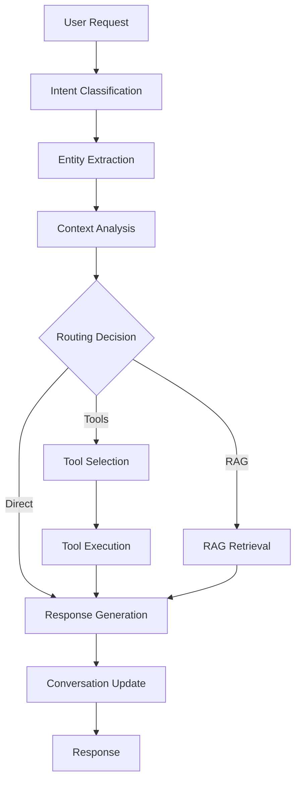

# WearForce-Clean NLU/Agent Router Service

A comprehensive Natural Language Understanding and Agent Router service built with FastAPI, LangGraph, and modern AI/ML technologies. This service provides intelligent conversation management, intent classification, entity extraction, and tool orchestration for CRM/ERP operations.

## 🚀 Features

### Core Capabilities
- **Multi-Agent Orchestration**: LangGraph-based workflow management with specialized agents
- **Intent Classification**: Rule-based and ML-powered intent recognition with business-specific patterns
- **Entity Extraction**: spaCy NLP integration with custom business entity types
- **Tool Dispatcher**: HTTP-based CRM/ERP integration with retry logic and caching
- **Conversation Management**: Redis-backed conversation state with analytics and insights
- **Smart Routing**: Automatic routing between RAG, tools, and direct responses

### Advanced Features
- **Rate Limiting**: Configurable rate limiting for tool executions
- **Response Caching**: Intelligent caching for frequently used tool results
- **Error Handling**: Comprehensive error handling with fallback mechanisms
- **Monitoring**: Prometheus metrics and health checks
- **Multi-Language Support**: Extensible language support framework
- **Real-time Analytics**: Conversation insights and performance metrics

## 🏗️ Architecture

### Service Components
```
├── main.py                     # FastAPI application and endpoints
├── langgraph_orchestrator.py   # LangGraph workflow orchestration
├── conversation_manager.py     # Redis-backed conversation management
├── intent_classifier.py       # Intent classification with ML/rules
├── entity_extractor.py        # spaCy + business entity extraction
├── tool_dispatcher.py         # HTTP-based tool integration
└── requirements.txt           # Python dependencies
```

### Workflow Architecture


## 🛠️ Installation

### Prerequisites
- Python 3.11+
- Docker and Docker Compose
- Redis (for conversation storage)
- PostgreSQL (for analytics)

### Quick Start

1. **Clone the repository**
```bash
git clone <repository-url>
cd nlu-service
```

2. **Install dependencies**
```bash
pip install -r requirements.txt
python -m spacy download en_core_web_sm
```

3. **Start development environment**
```bash
./start-dev.sh
```

4. **Access the service**
- API: http://localhost:8003
- Health: http://localhost:8003/health
- Docs: http://localhost:8003/docs
- Prometheus: http://localhost:9090
- Grafana: http://localhost:3003 (admin/admin)

## 🔧 Configuration

### Environment Variables

#### Core Settings
```env
SERVICE_NAME=nlu-service
PORT=8003
DEBUG=false
LOG_LEVEL=INFO
ENVIRONMENT=production
```

#### Database Configuration
```env
# Redis for conversations
REDIS_HOST=localhost
REDIS_PORT=6379
REDIS_DB=1
REDIS_PASSWORD=

# PostgreSQL for analytics
DB_HOST=localhost
DB_PORT=5432
DB_USER=nlu_user
DB_PASSWORD=nlu_password
DB_NAME=nlu_db
```

#### Service Integration
```env
# AI Services
LLM_SERVICE_URL=http://localhost:8004
RAG_SERVICE_URL=http://localhost:8005

# External APIs
CRM_API_URL=http://localhost:3000/api
ERP_API_URL=http://localhost:3001/api
```

#### NLU Specific Settings
```env
MAX_CONVERSATION_HISTORY=50
CONVERSATION_TTL=3600
RATE_LIMIT_PER_MINUTE=120
```

## 📚 API Reference

### Core Endpoints

#### Process Natural Language Understanding
```http
POST /nlu
Content-Type: application/json

{
  "text": "Create a contact for John Doe",
  "language": "en",
  "classify_intent": true,
  "extract_entities": true,
  "conversation_id": "optional-conv-id"
}
```

#### Agent Request Processing
```http
POST /agent
Content-Type: application/json

{
  "text": "I need to create a new contact for John Doe with email john@example.com",
  "conversation_id": "conv-123",
  "user_id": "user-456",
  "context": {
    "user_type": "admin"
  }
}
```

#### Streaming Agent Response
```http
POST /agent/stream
Content-Type: application/json

{
  "text": "Generate a sales report for last month",
  "conversation_id": "conv-123"
}
```

### Conversation Management

#### Get Conversation History
```http
GET /conversations/{conversation_id}
```

#### Add Message to Conversation
```http
POST /conversations/{conversation_id}/messages
Content-Type: application/json

{
  "role": "user",
  "content": "Hello",
  "metadata": {}
}
```

### Tool Management

#### List Available Tools
```http
GET /tools
```

#### Execute Tool Manually
```http
POST /tools/execute
Content-Type: application/json

{
  "tool_name": "create_crm_contact",
  "parameters": {
    "name": "John Doe",
    "email": "john@example.com"
  }
}
```

### Analytics & Monitoring

#### Service Statistics
```http
GET /stats
```

#### Health Check
```http
GET /health
```

#### Prometheus Metrics
```http
GET /metrics
```

## 🎯 Supported Intents

### CRM Operations
- `create_contact` - Create new contacts
- `search_contact` - Find existing contacts
- `update_contact` - Modify contact information
- `schedule_meeting` - Schedule meetings

### ERP Operations
- `create_order` - Create purchase orders
- `search_order` - Find existing orders
- `get_inventory` - Check inventory levels
- `update_inventory` - Modify inventory
- `generate_report` - Generate business reports

### General Operations
- `greeting` - Handle greetings
- `help` - Provide assistance
- Custom intents can be easily added

## 🏷️ Supported Entities

### Standard Entities
- `PERSON` - Person names
- `ORGANIZATION` - Company names
- `EMAIL` - Email addresses
- `PHONE` - Phone numbers
- `MONEY` - Monetary amounts
- `DATE` - Dates and times

### Business Entities
- `EMPLOYEE_ID` - Employee identifiers
- `CUSTOMER_ID` - Customer identifiers
- `ORDER_ID` - Order numbers
- `PRODUCT_CODE` - Product codes
- `INVOICE_NUMBER` - Invoice numbers
- `TICKET_ID` - Support ticket IDs

## 🔧 Available Tools

### CRM Tools
- **create_crm_contact** - Create new contacts
- **search_crm_contacts** - Search contacts
- **update_crm_contact** - Update contact info
- **schedule_crm_meeting** - Schedule meetings

### ERP Tools
- **create_erp_order** - Create orders
- **search_erp_orders** - Search orders
- **get_erp_inventory** - Get inventory data
- **update_erp_inventory** - Update inventory
- **generate_erp_report** - Generate reports

## 🧪 Testing

### Running Tests
```bash
# Run all tests
python -m pytest test_nlu_service.py -v

# Run with coverage
python -m pytest test_nlu_service.py --cov=. --cov-report=html

# Run specific test class
python -m pytest test_nlu_service.py::TestIntentClassifier -v
```

### Test Coverage
The test suite covers:
- ✅ Intent classification accuracy
- ✅ Entity extraction precision
- ✅ Tool dispatcher functionality
- ✅ Conversation management
- ✅ LangGraph orchestration
- ✅ Error handling scenarios
- ✅ API endpoint validation

## 🐳 Docker Deployment

### Development
```bash
docker-compose -f docker-compose.dev.yml up -d
```

### Production
```bash
# Build production image
docker build --target production -t wearforce-clean/nlu-service:latest .

# Run with environment variables
docker run -d \
  --name nlu-service \
  -p 8003:8003 \
  -e REDIS_HOST=redis \
  -e DB_HOST=postgres \
  wearforce-clean/nlu-service:latest
```

### Multi-stage Build
The Dockerfile supports multiple stages:
- **builder**: Builds dependencies and downloads models
- **production**: Minimal runtime image
- **development**: Includes development tools

## 📊 Monitoring & Observability

### Metrics
The service exposes Prometheus metrics:
- Request count and latency
- Intent classification accuracy
- Entity extraction performance
- Tool execution statistics
- Conversation analytics

### Logging
Structured logging with:
- Request/response tracing
- Error tracking
- Performance monitoring
- Business event logging

### Health Checks
- Service health endpoint
- Dependency health checks
- Resource utilization monitoring

## 🔒 Security Features

- Non-root container execution
- Input validation and sanitization
- Rate limiting and throttling
- Secure dependency management
- Environment-based configuration

## 🚀 Performance Optimization

### Caching Strategy
- Tool result caching with TTL
- Intent classification caching
- Conversation context caching

### Concurrency Management
- Async/await throughout
- Connection pooling
- Request batching for tools
- Background task processing

### Resource Management
- Memory usage optimization
- Connection lifecycle management
- Cleanup procedures

## 🔄 Development Workflow

### Code Quality
```bash
# Format code
black .
isort .

# Lint code
flake8 .
ruff check .

# Type checking
mypy .
```

### Git Hooks
Pre-commit hooks ensure:
- Code formatting
- Linting compliance
- Test execution
- Security scanning

## 📈 Roadmap

### Planned Features
- [ ] Multi-language intent classification
- [ ] Advanced entity linking
- [ ] Custom model fine-tuning
- [ ] Workflow visual editor
- [ ] Advanced analytics dashboard
- [ ] A/B testing framework

### Performance Improvements
- [ ] GPU acceleration for ML models
- [ ] Distributed caching
- [ ] Load balancing support
- [ ] Horizontal scaling

## 🤝 Contributing

### Development Setup
1. Fork the repository
2. Create a feature branch
3. Install development dependencies
4. Run tests and linting
5. Submit a pull request

### Code Style
- Follow PEP 8 guidelines
- Use type hints throughout
- Write comprehensive docstrings
- Maintain test coverage >90%

## 📄 License

This project is licensed under the MIT License - see the LICENSE file for details.

## 🆘 Support

For support and questions:
- Create an issue on GitHub
- Check the documentation
- Review the test examples
- Contact the development team

---

**WearForce-Clean NLU Service** - Empowering intelligent conversations and business automation. 🚀